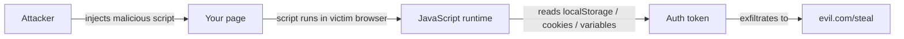
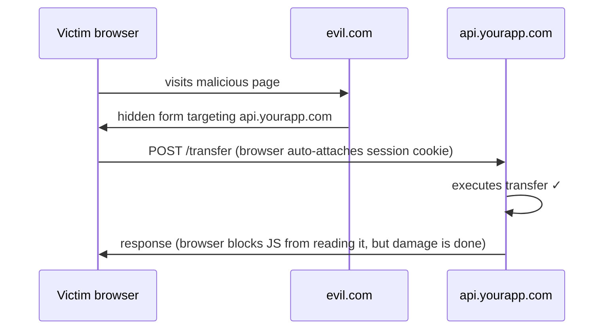
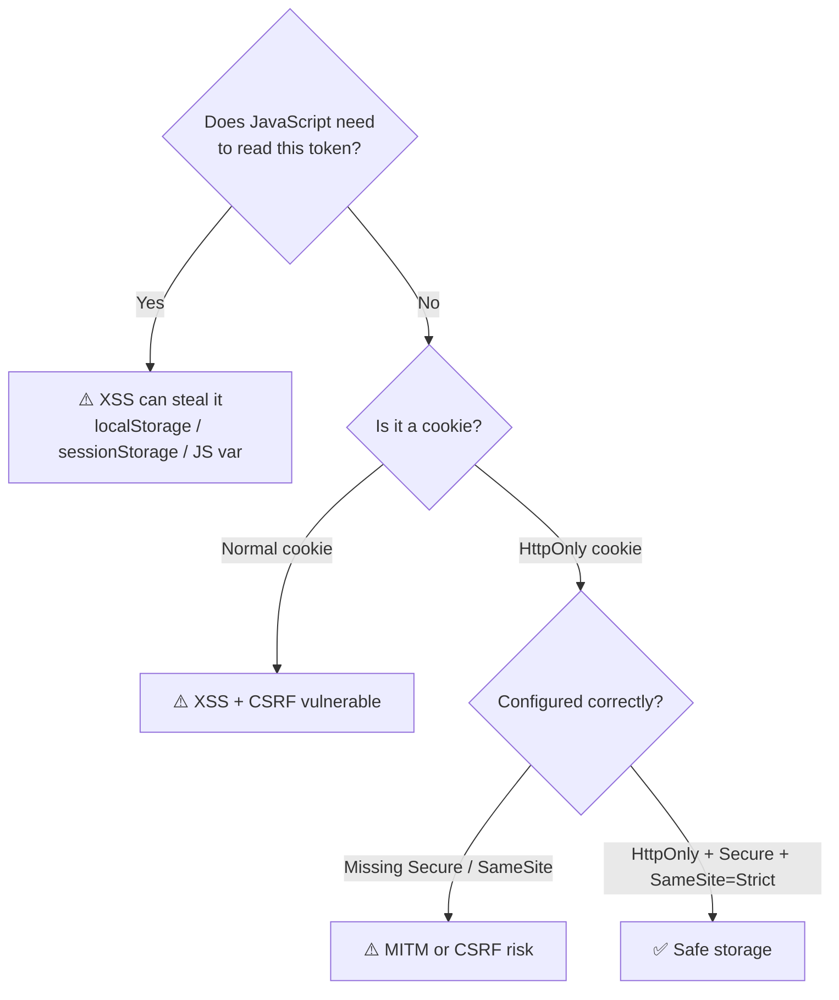
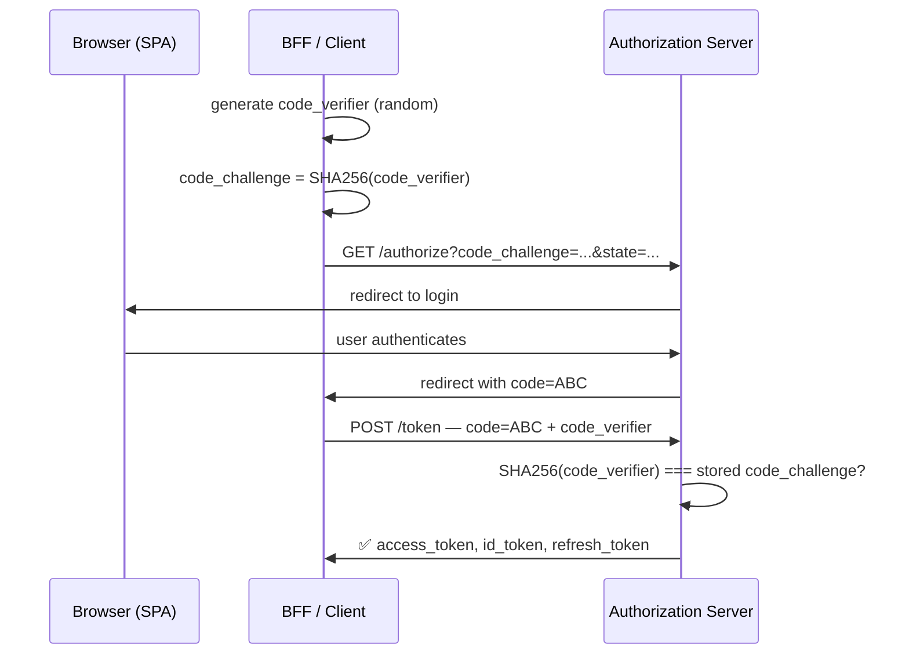
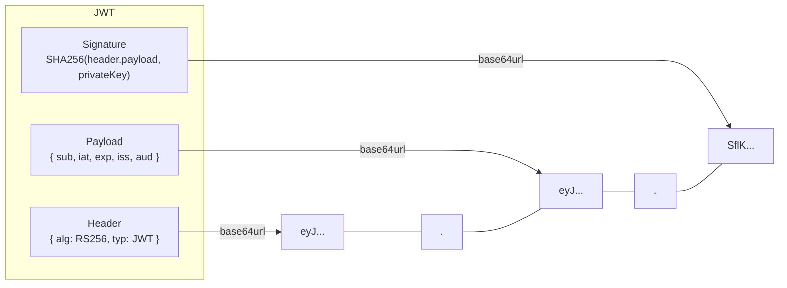
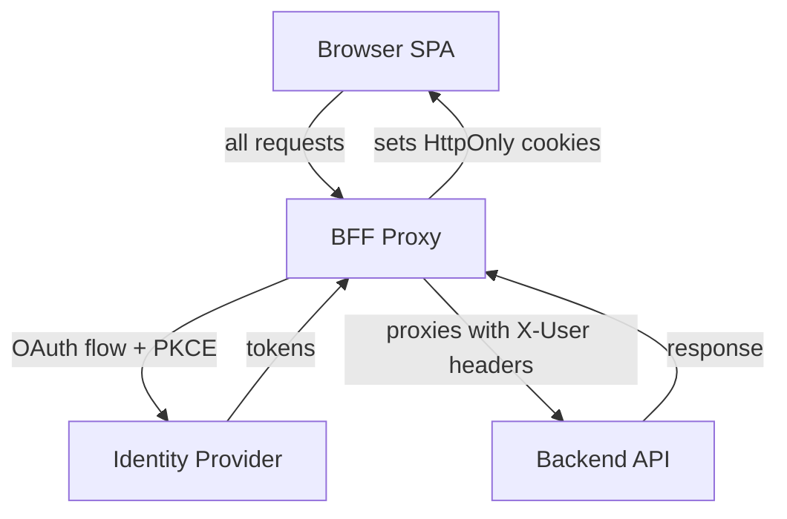
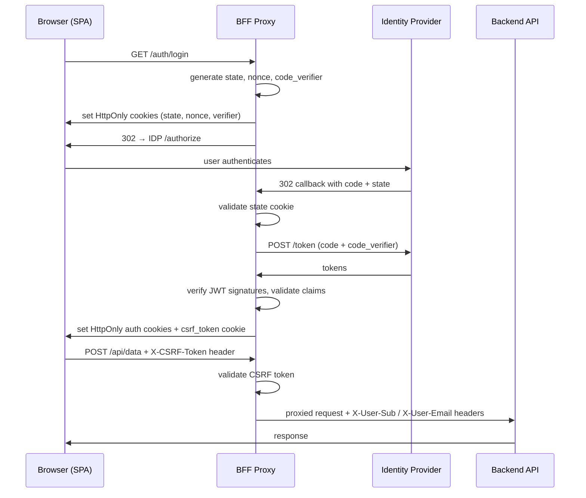

# The Browser That Knew Too Much

_XSS, CSRF, OAuth 2.0, JWTs, the BFF Pattern, and are you ready for Claude Mythos?_

> _A note before we start: don't take my word for any of this. Security is a field where second opinions matter. Read the specs, check what others have implemented, and form your own conclusions. What follows is my attempt to connect a lot of dots that had been floating separately in my head — and I may have gotten some of them wrong. If you spot something, say so in the comments._

Web security is one of those domains where the gap between knowing a concept and applying it correctly is surprisingly wide. XSS, CSRF, MITM — everyone's heard of them. But the path from "I know what XSS is" to "my token storage is actually safe" is full of non-obvious decisions.

And right now, that gap matters more than ever.

In April 2026, Anthropic announced **Claude Mythos Preview** — a new tier of model, larger and more capable than any Opus before it, with cybersecurity skills the industry is still processing. Used with Claude Code, Mythos reads a codebase, hypothesizes vulnerabilities, runs the actual application to confirm or reject them, and produces a bug report with a proof-of-concept exploit — autonomously, in parallel across every file. In pre-release testing it found thousands of previously unknown zero-day vulnerabilities across every major operating system and browser, including a 27-year-old flaw in OpenBSD and a 16-year-old flaw in FFmpeg, bugs that had survived decades of human review and millions of automated tests. Anthropic responded by launching **Project Glasswing**, a $100M initiative to use Mythos to harden the world's most critical software, in partnership with AWS, Apple, Microsoft, Google, and CrowdStrike.

The implication is direct: soon, customers, auditors, and non-technical stakeholders will be able to point an agent at a vendor's application and get a structured security report without writing a single line of code. The question is no longer whether your authentication flow is safe from an attacker who knows what they're doing. It's whether it holds up against a model that can reason through your entire codebase in minutes.

This article gives you the mental model to answer that question. It covers the classic attacks that are still the first things any security tool checks — XSS, CSRF, MITM — then works through secure token storage, Content Security Policy, OAuth 2.0, JWT vulnerabilities, and the Backend for Frontend pattern that ties it all together.

## Part 1: The Classic Attacks (That Still Work)

### XSS — Cross-Site Scripting

XSS is old. It's been on the OWASP Top 10 for decades. It also keeps happening.

The concept is simple: an attacker finds a way to inject JavaScript into your page. Once that script runs in a victim's browser, it has access to everything JavaScript can touch, cookies, localStorage, sessionStorage, runtime variables. It can silently exfiltrate tokens, session IDs, or form data to an attacker-controlled server.

**Real-world examples:**

- **British Airways (2018):** Attackers injected a script via a vulnerable third-party library (`Feedify`) on the checkout page. Around 380,000 booking transactions were skimmed before it was caught.
- **Fortnite (2019):** An XSS vulnerability could redirect players to a fake login page, enabling credential theft and account takeover across 200+ million accounts.

**"But I'm using React/Vue/Angular..."**

Modern frameworks escape output by default, which helps. But it doesn't eliminate the risk:

- `dangerouslySetInnerHTML` in React and `v-html` in Vue bypass escaping entirely
- Third-party libraries can be vulnerable - or, as happened with `axios@1.14.1` in early 2025, they can be _deliberately compromised_ in a supply chain attack that installs a Remote Access Trojan on developer machines
- Browser extensions running on your site are outside your control entirely

**The key conclusion:**

> _"Any data accessible to JavaScript is accessible to an attacker via XSS."_

It doesn't matter if it's in localStorage, sessionStorage, or a runtime variable. If JavaScript can read it, so can an attacker who achieves XSS. This single observation shapes every storage decision we'll make later.



### CSRF — Cross-Site Request Forgery

Where XSS tries to _steal_ your credentials, CSRF tries to _use_ them without you knowing.

The attack exploits the fact that browsers automatically attach cookies to requests, regardless of where the request originates. An attacker can craft a malicious page that silently sends a POST request to your bank (or your app), and the browser will helpfully include the session cookie.

The victim doesn't lose their token. They just unknowingly transfer money, change their email, or perform whatever action the attacker engineered.

**Real-world example:**
TikTok (2020), attackers could send malicious messages that exploited a CSRF/XSS combination to force accounts to perform actions without user consent. The patch took three weeks, during which the scale of exploitation is unknown.

A key characteristic of CSRF attacks: they look like normal user activity in server logs. They're systematically underreported.



### "But… doesn't CORS protect us from CSRF?"

This is one of the most common misconceptions in web security. The short answer: not really.

**CORS** (Cross-Origin Resource Sharing) is a browser mechanism that _relaxes_ the Same-Origin Policy. By default, JavaScript on `evil.com` cannot read the _response_ from `api.yourapp.com`. CORS allows you to selectively open that up.

But CSRF doesn't need to read the response. Certain requests — simple ones like a `GET` or a plain `POST` with a standard content type — are sent by the browser _before_ any CORS preflight check. The server receives and executes the request; only then does the browser decide whether to show the response to JavaScript. This means a `GET /logout` and a `POST /transfer` can both be triggered cross-origin without preflight, and your server has already acted on them. The HTTP method matters: endpoints that mutate state should never be reachable via `GET`, and relying on CORS alone to block `POST` requests is not safe either.

Also worth noting: CORS is enforced by _browsers_. Tools like `curl`, Postman, or any backend-to-backend call ignore it entirely. CORS is not server-side security, it's a browser UX policy.

### MITM — Man in the Middle

MITM attacks intercept traffic between client and server. Common vectors: public Wi-Fi, DNS poisoning, compromised routers.

The standard defense is HTTPS, which encrypts traffic so an eavesdropper sees only noise.

**But HTTPS alone isn't enough.** If a session cookie lacks the `Secure` flag, the browser may send it over unencrypted connections too. An attacker on the same network who downgrades your connection can still intercept it.

HTTPS is necessary but not sufficient. The cookie configuration matters too.

## Part 2: Secure Token Storage

Here's where it all comes together. After understanding the attack surface, the question is: **where should we store authentication tokens?**

Let's look at the options honestly:

| Storage               | JS Access | XSS Vulnerable | CSRF Vulnerable  | Auto-sent |
| --------------------- | --------- | -------------- | ---------------- | --------- |
| `localStorage`        | Yes       | Yes            | No               | No        |
| `sessionStorage`      | Yes       | Yes            | No               | No        |
| JS variable (runtime) | Yes       | Yes            | No               | No        |
| Normal cookie         | Yes       | Yes            | Yes              | Yes       |
| **HTTP-only cookie**  | **No**    | **No**         | **Configurable** | **Yes**   |

The first three rows, localStorage, sessionStorage, JS variables, all share the same problem: JavaScript can read them, which means XSS can steal them.



Normal cookies are actually _worse_: they're XSS-vulnerable _and_ CSRF-vulnerable.

The only option that removes JavaScript access by design is an **HTTP-only cookie**. Because JS can't read it, XSS can't steal it. The CSRF risk remains, but it can be addressed through cookie configuration.

> _"By keeping the token outside of JavaScript's reach, even if an XSS vulnerability occurs, the attacker will not be able to steal the user's authentication credentials."_

### Cookie Attributes That Matter

Once you're using HTTP-only cookies, the configuration of those cookies becomes critical:

| Attribute  | Purpose                      | Protects Against |
| ---------- | ---------------------------- | ---------------- |
| `HttpOnly` | Prevents JavaScript access   | XSS              |
| `Secure`   | Sent only over HTTPS         | MITM             |
| `SameSite` | Restricts cross-site sending | CSRF             |
| `Path`     | Limits cookie scope          | Scope abuse      |
| `Max-Age`  | Limits lifetime              | Long exposure    |

All five matter. `SameSite=Strict` or `SameSite=Lax` addresses most CSRF risk at the cookie level.

If you want to experiment with how cookie attributes affect real attack scenarios, this playground walks through it interactively:  
[tkachenko0/cookies-playground](https://github.com/tkachenko0/cookies-playground)

## Part 3: Content Security Policy

Even with good storage practices, XSS is still a threat if an attacker can inject scripts into your page. **Content Security Policy (CSP)** is a secondary defense that limits the damage.

A CSP is a response header that tells the browser: "Only load scripts, styles, and images from these trusted sources. Block everything else."

```
Content-Security-Policy: default-src 'self'; script-src 'self' https://trusted-cdn.com
```

Beyond blocking attacks, CSP enforces good engineering habits:

- Inline `<script>` blocks? Blocked - logic lives in files
- Random third-party CDN dropped in without review? Blocked
- A library that uses `eval()`? Breaks visibly, forcing a conscious decision
- Undeclared analytics, chat widgets, or payment SDKs? Blocked - everything external must be declared

CSP also has a `report-to` directive that sends violation data to your endpoint, giving you visibility into attempted injections or misconfigurations.

**Bad patterns should fail fast and loud.** CSP makes that happen.

If you want to see CSP in action and understand what it blocks (and why), this playground lets you experiment live:  
[tkachenko0/csp-playground](https://github.com/tkachenko0/csp-playground)

And to evaluate whether an existing CSP policy is strong enough:  
[CSP Evaluator (Google)](https://csp-evaluator.withgoogle.com/)

## Part 4: OAuth 2.0

Once you understand token storage, the next question is how tokens get issued in the first place. That's where **OAuth 2.0** comes in.

OAuth 2.0 is an authorization framework that allows an application to access resources on behalf of a user, without ever handling the user's credentials. The application gets a _token_ that represents delegated permission, not a password.

**Four key roles:**

- **Resource Owner** - the user
- **Client** - your application
- **Authorization Server** - issues tokens (e.g., Auth0, Cognito, Keycloak)
- **Resource Server** - your API, which validates tokens on each request

### Which Flow Should You Use?

OAuth 2.0 defines several "grant types" (flows). For SPAs, the right choice is:

**Authorization Code Flow with PKCE** — and here's why.

The basic Authorization Code flow works like this: the user authenticates with the Authorization Server, which returns a short-lived _code_ to the client. The client exchanges that code for tokens. This is secure for server-side apps that can store a **Client Secret**, used to authenticate the client during the exchange.

SPAs can't store secrets. Any secret embedded in frontend code is visible to anyone who opens DevTools.

**PKCE (Proof Key for Code Exchange)** solves this:

1. Before the flow starts, the client generates a random `code_verifier`
2. It sends a hashed version (`code_challenge`) to the Authorization Server
3. When exchanging the code for tokens, the client proves it holds the original `code_verifier`

Even if an attacker intercepts the authorization code, they can't exchange it without the verifier.



PKCE is now **mandatory for all public clients** and will be the standard in OAuth 2.1.

### OAuth 2.0 — What Can Go Wrong

Several implementation mistakes routinely turn up in real applications:

**Missing state parameter validation** — The `state` parameter is a random value the client generates and includes in the authorization request. The server echoes it back, and the client _must_ verify it matches. Without this check, an attacker can craft a CSRF attack on the OAuth flow itself, forcing a victim to link their account to the attacker's identity provider account.

**Missing nonce validation** — Similar to state, the `nonce` binds the ID token to a specific session. Skipping it opens replay attack vectors.

**Weak or absent token validation** — APIs must verify all of these on every token:

- `iss` (issuer): is this from the expected authorization server?
- `aud` (audience): is this token intended for this API?
- `exp` (expiration): is this token still valid?
- Signature: has the token been modified?

Skipping any of these is not "good enough." An expired token, a token from the wrong tenant, or a token forged by algorithm confusion all look valid to code that doesn't check.

## Part 5: JWTs — Structure and Vulnerabilities

Access tokens are commonly issued as **JSON Web Tokens (JWTs)**. A JWT is a self-contained, signed JSON structure, the server can verify its authenticity without a database lookup.

A JWT has three Base64-encoded parts separated by dots:

```
header.payload.signature
```

- **Header**: algorithm (`alg`) and token type
- **Payload**: claims - `sub`, `iat`, `exp`, `iss`, `aud`
- **Signature**: cryptographic proof the token hasn't been tampered with



Algorithms can be symmetric (shared secret, e.g. HS256) or asymmetric (private key signs, public key verifies, e.g. RS256).

### JWT Attack Patterns

**Signature not verified**
Some implementations decode the token to read claims without verifying the signature. An attacker can modify `sub` to impersonate any user. This still shows up in penetration tests.

**Algorithm None attack**
The JWT spec includes `"alg": "none"`, meaning no signature is required. If a server accepts this, an attacker can craft arbitrary tokens with no secret required. Fix: **whitelist allowed algorithms explicitly** — never blacklist.

**Algorithm Confusion (RS256 → HS256)**
If the server uses RS256 (asymmetric), the public key is by definition public. An attacker can switch the header to HS256 (symmetric) and sign the token using the _public key as the secret_. If the server doesn't enforce which algorithm it expects, it will verify this as valid.

Fix: **explicitly enforce the expected algorithm**. Never let the token header dictate how it gets verified.

**Missing claim validation**
A valid signature doesn't mean the claims are valid. `exp`, `iss`, `aud`, and `sub` must all be checked independently. A token issued for a different application, or one that expired last year, is still cryptographically valid.

For testing JWT vulnerabilities: [jwt.io](https://jwt.io) for inspection, and `jwt_tool.py` for attack simulation.

## Part 6: The Backend for Frontend (BFF) Pattern

After all of the above, one conclusion is unavoidable:

> _"An authentication flow that is free from XSS, CSRF, and MITM cannot reside in the frontend. It must be handled either as an additional layer between frontend and backend, or entirely on the backend."_

The **Backend for Frontend (BFF)** pattern is the architectural response to this.

In a traditional SPA architecture, the frontend handles the entire OAuth flow: redirects, code exchange, token storage, token refresh. Every token lives in the browser, accessible to JavaScript.

The BFF pattern introduces a thin backend layer, co-located with the frontend, acting as its proxy, that owns the entire authentication flow:



**How it works:**

1. User clicks "Login" in the SPA
2. The BFF redirects to the Identity Provider
3. The Identity Provider redirects back to the BFF with the authorization code
4. The BFF exchanges the code for tokens (server-side, with PKCE and state validation)
5. The BFF sets an HTTP-only, Secure, SameSite cookie, tokens never touch the browser's JavaScript
6. Subsequent API calls from the SPA go through the BFF, which attaches the token server-side



**The result:**

> _"The frontend doesn't know OAuth exists. The backend doesn't know tokens exist."_

The SPA just makes HTTP requests. Authentication is handled entirely outside JavaScript's reach.

> **Demo note:** In the demo accompanying this article, the BFF passes the access token, refresh token, and ID token directly as HTTP-only cookies for simplicity. This is purely for demonstration purposes. In a real-world implementation, the BFF can issue its own opaque session token or a self-signed JWT, store the refresh token in a server-side in-memory store (e.g. Redis), and never expose the original OAuth tokens to the browser at all. The details of that internal token management strategy, session design, refresh logic, Redis integration, are out of scope for this article, but worth exploring as a natural next step.

### BFF Security Checklist

A properly implemented BFF addresses the full threat model:

- **XSS**: HTTP-only cookies, JavaScript can never read the token
- **CSRF**: Two layers — `SameSite=Strict` on auth cookies, plus the **Double Submit Cookie Pattern**: after login, the BFF sets a separate `csrf_token` cookie with `httpOnly: false` so the frontend can read it via JavaScript and send it as an `X-CSRF-Token` header on every `/api/*` request. The BFF validates the match using `crypto.timingSafeEqual` to prevent timing attacks. An attacker on a different origin can cause the browser to send the cookie automatically, but cannot read its value to forge the header.
- **MITM**: `Secure=true` flag, tokens only travel over HTTPS
- **JWT**: Signature verification via JWKS, explicit algorithm whitelist, full claim validation (`iss`, `aud`, `exp`, `sub`), plus token consistency check — if only one of `id_token`/`access_token` is present, the session is considered tampered and all cookies are cleared
- **OAuth 2.0**: State parameter validation, nonce validation, PKCE (`code_challenge`/`code_verifier`)

### BFF Notes and Trade-offs

- The BFF doesn't have to be a generic proxy. It can be implemented as a library for a specific framework, eliminating the extra network hop
- For mobile apps, cookie-based flows are more complex since mobile isn't a browser, cookie handling isn't native
- If you already have a SPA + backend using a managed provider (Cognito, Keycloak, Azure AD), BFF integration is straightforward

The open-source implementation referenced throughout this article is available at [tkachenko0/oauth2-bff-proxy](https://github.com/tkachenko0/oauth2-bff-proxy). It supports AWS Cognito, Microsoft Entra ID, and Keycloak out of the box, and the README documents every security decision in detail — including exactly why each cookie attribute is set the way it is, and how the Double Submit Cookie Pattern is wired up end-to-end.

## So, Are You Ready for Claude Mythos?

Everything in this article — cookie attributes, PKCE, JWT claim validation, the BFF pattern — represents the exact layer of defenses that a model like Mythos will probe first.

**Claude Code Security**, available today via the `/security-review` command in Claude Code, already reasons through codebases the way a human security researcher would: tracing data flows across files, reading Git history, understanding business logic. It catches authentication bypasses and broken access control that pattern-matching tools miss entirely, and a companion GitHub Action can trigger automatically on every pull request. Early 2026 also saw an explosion of MCP-based pentesting projects connecting Claude Code to tools like nmap, Metasploit, and Nuclei — meaning an agent can find a vulnerability statically, then probe a running application dynamically, generate a payload, analyze the response, and retry.

Mythos takes this further. Anthropic has stated that its goal is to enable safe deployment of Mythos-class capabilities at scale. Other AI labs are building comparable models. The window between a vulnerability being discovered and being exploited has collapsed — what once took months now happens in minutes.

The patterns in this article aren't defensive theory. They're the checklist Claude Mythos will run against your application — and the reason it should find nothing.

---

## A Note on Zero-Day Attacks

Everything above addresses _known_ vulnerabilities, attacks that have been documented, catalogued, and defended against for years.

There's a harder category: **zero-day attacks**. These are vulnerabilities for which defenders had zero days to prepare. The `axios` supply chain attack mentioned earlier, where a compromised package version installed a Remote Access Trojan, is an example. No amount of CSRF protection would have helped.

The useful observation is this: the _known_ attacks are often easier to land than zero-days, precisely because they're well-understood and patterns for exploiting them are widely shared. By implementing the defenses above consistently, you also raise the floor high enough that it becomes harder to chain zero-day vectors with known weaknesses.

## Wrapping Up

The thread connecting everything here is a single principle: **security by design means keeping sensitive data in places where the attack surface can't reach it**.

- Tokens accessible to JavaScript can be stolen via XSS
- Cookies without proper attributes can be hijacked or forged
- OAuth flows without state, nonce, and PKCE can be subverted
- JWTs without full claim validation can be replayed or forged
- Frontend-only authentication architectures concentrate risk in the worst possible place

The BFF pattern is the architectural expression of this principle: by moving authentication out of the browser, you remove an entire class of vulnerabilities by construction rather than by defense.

## Resources and Playgrounds

**Interactive tools (open source):**

- [csp-playground](https://github.com/tkachenko0/csp-playground) - Learn CSP by seeing and preventing XSS attacks
- [cookies-playground](https://github.com/tkachenko0/cookies-playground) - Experiment with cookie attributes and their security impact
- [TokenLeaks](https://github.com/tkachenko0/TokenLeaks) - Browser extension that shows what sensitive data a web page exposes to JavaScript

**Reference:**

- [OWASP XSS](https://owasp.org/www-community/attacks/xss/)
- [Auth0 - OAuth 2.0](https://auth0.com/docs/get-started/authentication-and-authorization-flow)
- [Auth0 - PKCE Flow](https://auth0.com/docs/get-started/authentication-and-authorization-flow/authorization-code-flow-with-pkce)
- [CSP Evaluator](https://csp-evaluator.withgoogle.com/)
- [jwt.io](https://jwt.io)
- [RFC 7519 - JSON Web Token](https://datatracker.ietf.org/doc/html/rfc7519)

> _If something here is wrong, incomplete, or could be explained better, I'd genuinely like to know. Drop a comment below — this is the kind of topic where the discussion is often more valuable than the article._
