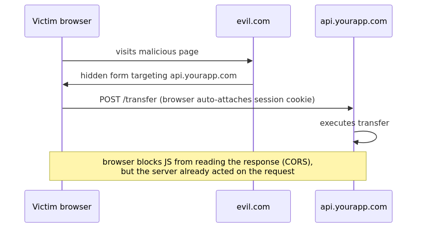
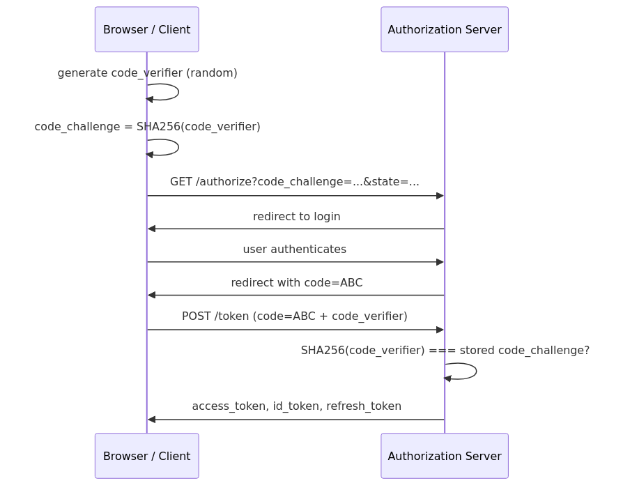
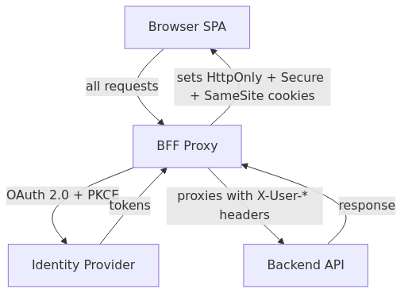
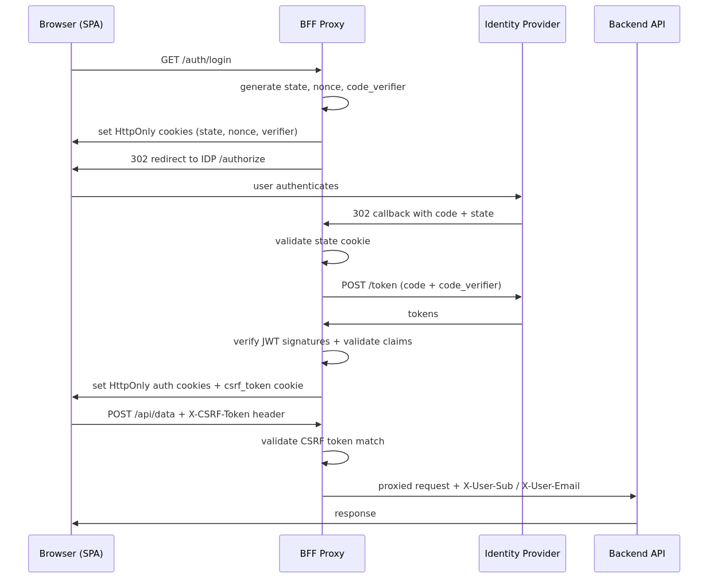

# The Browser That Knew Too Much

_XSS, CSRF, OAuth 2.0, JWTs, the BFF Pattern, and are you ready for Claude Mythos?_

Web security is one of those domains where the gap between knowing a concept and applying it correctly is surprisingly wide. XSS, CSRF, MITM...
Everyone's heard of them. But the path from "I know what XSS is" to "my token storage is actually safe" is full of non obvious decisions.

And right now, that gap matters more than ever.

Quick honesty check before we start: putting [**Claude Mythos Preview**](https://red.anthropic.com/2026/mythos-preview/) in the title is a bit of clickbait. Yes, in April 2026 Anthropic announced it had found thousands of zero-days, with [a 27-year-old bug in OpenBSD and a 16-year-old one in FFmpeg](https://thehackernews.com/2026/04/anthropics-claude-mythos-finds.html). And yes, in the weeks after launch, a fair chunk of that has been walked back, so the marketing is louder than what you actually get.

But pretend for a second the launch was 30% as impressive as advertised. That's still a lot. Models are getting genuinely better at reading a codebase, guessing where it might break, running the app to check, and writing the result up like a junior pentester would. So it's not a stretch anymore to picture a customer, or a compliance person, or a curious auditor pointing an agent at your app and emailing you back a list of issues without ever opening your repo. There's the skeptic side and the slightly nervous side, and both of them can be true at the same time. This article is for the nervous side.

### Who this article is for

I wrote this for the dev who has tried, in good faith, to understand how authentication is actually supposed to work, and ended up more confused than when they started. You open a tab that tells you `localStorage` is fine for JWTs, and the next one calls it the worst possible idea. Someone hands you a "minimal secure example" that turns out to be a textbook CSRF. The official docs assume you already know the threat model. Libraries assume you read the spec.

If that's roughly your situation, this is meant to be the article I wish I'd had.

> _A note before we start: don't take my word for any of this. Security is a field where second opinions matter. Read the specs, check what others have implemented, and form your own conclusions. What follows is my attempt to connect a lot of dots that had been floating separately in my head and I may have gotten some of them wrong. If you spot something, say so in the comments._

## The Classic Attacks

### XSS - Cross-Site Scripting

XSS is old. It's been on the [OWASP Top 10](https://owasp.org/www-project-top-ten/) for decades. It also keeps happening.

The concept is simple, an attacker finds a way to inject JavaScript into your page. Once that script runs in a victim's browser, it has access to everything JavaScript can touch, cookies, localStorage, sessionStorage, runtime variables. It can silently exfiltrate tokens, session IDs, or form data to an attacker controlled server.

**"But I'm using React/Vue/Angular..."**

Modern frameworks escape output by default, which helps. But it doesn't eliminate the risk:

- [`dangerouslySetInnerHTML`](https://react.dev/reference/react-dom/components/common#dangerously-setting-the-inner-html) in React and [`v-html`](https://vuejs.org/api/built-in-directives.html#v-html) in Vue bypass escaping entirely
- Third-party libraries can be vulnerable or, as happened with `axios@1.14.1` on March 30, 2026, they can be _deliberately compromised_ in a supply chain attack that installs a cross-platform Remote Access Trojan on any machine that ran `npm install` during a two-hour window ([Snyk](https://snyk.io/blog/axios-npm-package-compromised-supply-chain-attack-delivers-cross-platform/), [Microsoft Security Blog](https://www.microsoft.com/en-us/security/blog/2026/04/01/mitigating-the-axios-npm-supply-chain-compromise/), [Unit 42](https://unit42.paloaltonetworks.com/axios-supply-chain-attack/))
- Browser extensions running on your site are outside your control entirely

> _"Any data accessible to JavaScript is accessible to an attacker via XSS."_

It doesn't matter if it's in localStorage, sessionStorage, or a runtime variable. If JavaScript can read it, so can an attacker.

### CSRF - Cross-Site Request Forgery

Where XSS tries to _steal_ your credentials, CSRF tries to _use_ them without you knowing.

The attack exploits the fact that browsers automatically attach cookies to requests, regardless of where the request originates. An attacker can craft a malicious page that silently sends a POST request to your bank, and the browser will helpfully include the session cookie.

The victim doesn't lose their token. They just unknowingly transfer money.

A CSRF attack looks like normal user activity in server logs. They're systematically underreported.



### "But… doesn't CORS protect us from CSRF?"

Not really.

[**CORS**](https://developer.mozilla.org/en-US/docs/Web/HTTP/CORS) (Cross-Origin Resource Sharing) is a browser mechanism that _relaxes_ the [Same-Origin Policy](https://developer.mozilla.org/en-US/docs/Web/Security/Same-origin_policy). By default, JavaScript on `evil.com` cannot read the _response_ from `api.yourapp.com`. CORS allows you to selectively open that up.

But CSRF doesn't need to read the response.

Certain requests, simple ones like a `GET` or a plain `POST` with a standard content type, are sent by the browser _before_ any CORS preflight check.
Sometimes the server receives and executes the request, only then does the browser decide whether to show the response to JavaScript.

### MITM - Man in the Middle

MITM attacks intercept traffic between client and server. Common vectors are public Wi-Fi, DNS poisoning and compromised routers.

The standard defense is HTTPS, which encrypts traffic so an eavesdropper sees only noise.

HTTPS is necessary but not sufficient. The cookie configuration matters too.

## Secure Token Storage

Once the attack surface is clear, the obvious next question is: **where should we store authentication tokens?**

Let's look at the options honestly:

- **`localStorage`, `sessionStorage`, in-memory JS variables.** Readable by JavaScript, so vulnerable to XSS. Not auto-sent by the browser, so CSRF is not a concern, but the XSS risk alone is disqualifying.
- **Normal cookies.** Readable by JavaScript _and_ auto attached to every request. Worst of both worlds, XSS-vulnerable _and_ CSRF-vulnerable.
- **HTTP-only cookies.** Not readable by JavaScript, so XSS cannot steal them. They're still auto sent, so CSRF remains a concern, but it can be addressed through cookie configuration.

The first three options share the same fundamental problem, JavaScript can read them. The only option that removes JavaScript access by design is an **HTTP-only cookie**.

> _"By keeping the token outside of JavaScript's reach, even if an XSS vulnerability occurs, the attacker will not be able to steal the user's authentication credentials."_

### Cookie Attributes

Once you're using HTTP only cookies, the configuration of those cookies becomes important.

- **`HttpOnly`** prevents JavaScript from reading the cookie. Closes XSS.
- **`Secure`** restricts the cookie to HTTPS connections. Closes MITM.
- **`SameSite=Strict`** (or `Lax`) prevents the browser from sending the cookie on cross-site requests. Closes almost all CSRF vectors.
- **`Path`** limits the cookie to a subset of URLs on the domain, reducing the blast radius if it leaks.
- **`Max-Age`** caps the cookie's lifetime, limiting how long a stolen cookie stays useful.

If you want to experiment with how cookie attributes affect real attack scenarios, this playground walks through it:  
[tkachenko0/cookies-playground](https://github.com/tkachenko0/cookies-playground)

## Content Security Policy

Even with good storage practices, XSS is still a threat if an attacker can inject scripts into your page. [**Content Security Policy (CSP)**](https://developer.mozilla.org/en-US/docs/Web/HTTP/CSP) is a secondary defense that limits the damage.

A CSP is a response header that tells the browser: "Only load scripts, styles, and images from these trusted sources. Block everything else."

```
Content-Security-Policy: default-src 'self'; script-src 'self' https://trusted-cdn.com
```

I think that beyond blocking attacks, CSP enforces good engineering habits:

- Inline `<script>`? Blocked
- Random third-party CDN dropped in without review? Blocked
- A library that uses `eval()`? Blocked
- Undeclared analytics, chat widgets, or payment SDKs? Blocked

CSP also has a `report-to` directive that sends violation data to your endpoint, giving you visibility into attempted injections or misconfigurations.

**Bad patterns should fail fast and loud.** CSP makes that happen.

If you want to see CSP in action and understand what it blocks, this playground lets you experiment: [tkachenko0/csp-playground](https://github.com/tkachenko0/csp-playground)

## OAuth 2.0

Once you understand token storage, the next question is how tokens get issued in the first place. That's where **OAuth 2.0** comes in.

OAuth 2.0 is an authorization framework that allows an application to access resources on behalf of a user, without ever handling the user's credentials. The application gets a _token_ that represents delegated permission, not a password. The protocol is defined in [RFC 6749](https://datatracker.ietf.org/doc/html/rfc6749) and the current security recommendations live in [RFC 9700 — OAuth 2.0 Security Best Current Practice](https://datatracker.ietf.org/doc/html/rfc9700).

**Four key roles for a classic SPA with a backend:**

- **Resource Owner**, the user
- **Client**, your application
- **Authorization Server**, issues tokens (e.g. Cognito, Keycloak)
- **Resource Server** - your API, which validates tokens on each request

### Which Flow Should You Use?

OAuth 2.0 defines several "grant types" (flows). For SPAs, the right choice is:

**Authorization Code Flow with PKCE**. Here's why.

The basic Authorization Code flow works like this: the user authenticates with the Authorization Server, which returns a short-lived _code_ to the client. The client exchanges that code for tokens. This is secure for server-side apps that can store a **Client Secret**, used to authenticate the client during the exchange.

SPAs can't store a Client Secret securely. Any secret embedded in frontend code is exposed. And even without a secret, the Authorization Code alone is a liability: if intercepted in transit, an attacker can exchange it for tokens before your app does.

**PKCE ([Proof Key for Code Exchange](https://datatracker.ietf.org/doc/html/rfc7636))** solves this:

1. Before the flow starts, the client generates a random `code_verifier`
2. It sends a hashed version (`code_challenge`) to the Authorization Server
3. When exchanging the code for tokens, the client proves it holds the original `code_verifier`

Even if an attacker intercepts the authorization code, they can't exchange it without the verifier.



### OAuth 2.0: What Can Go Wrong

**Missing state parameter validation** The `state` parameter is a random value the client generates and includes in the authorization request. The server echoes it back, and the client _must_ verify it matches. Without this check, an attacker can craft a CSRF attack on the OAuth flow itself, forcing a victim to link their account to the attacker's identity provider account.

**Missing nonce validation** Similar to state, the `nonce` binds the ID token to a specific session.

**Weak or absent token validation** APIs must verify all of these on every token:

- `iss` (issuer): is this from the expected authorization server?
- `aud` (audience): is this token intended for this API?
- `exp` (expiration): is this token still valid?
- Signature: has the token been modified?

Skipping any of these is not "good enough." An expired token, a token from the wrong tenant, or a token forged by algorithm confusion all look valid to code that doesn't check.

## JWTs Structure and Vulnerabilities

Access tokens are commonly issued as **JSON Web Tokens (JWTs)**, defined in [RFC 7519](https://datatracker.ietf.org/doc/html/rfc7519). A JWT is a self-contained, signed JSON structure, the server can verify its authenticity without a database lookup. A JWT has three Base64-encoded parts separated by dots:

```
header.payload.signature
```

- **Header**: algorithm (`alg`) and token type
- **Payload**: claims - `sub`, `iat`, `exp`, `iss`, `aud`
- **Signature**: cryptographic proof the token hasn't been tampered with

Algorithms can be symmetric (shared secret, e.g. HS256) or asymmetric (private key signs, public key verifies, e.g. RS256).

### JWT Attack Patterns

**Signature not verified**
Some implementations decode the token to read claims without verifying the signature. An attacker can modify `sub` to impersonate any user. This still shows up in penetration tests.

**Algorithm None attack**
The JWT spec includes `"alg": "none"`, meaning no signature is required. If a server accepts this, an attacker can craft arbitrary tokens with no secret required. Fix: **whitelist allowed algorithms explicitly** and never blacklist.

**Algorithm Confusion**
If the server uses RS256 (asymmetric), the public key is by definition public. An attacker can switch the header to HS256 (symmetric) and sign the token using the _public key as the secret_. If the server doesn't enforce which algorithm it expects, it will verify this as valid.

Fix: **explicitly enforce the expected algorithm**

**Missing claim validation**
A valid signature doesn't mean the claims are valid. `exp`, `iss`, `aud`, and `sub` must all be checked independently. A token issued for a different application, or one that expired last year, is still cryptographically valid.

## The Backend for Frontend (BFF) Pattern

After all of the above, one conclusion is unavoidable:

> _"An authentication flow that is free from XSS, CSRF, and MITM cannot reside in the frontend. It must be handled either as an additional layer between frontend and backend, or entirely on the backend."_

The **Backend for Frontend** pattern is the architectural response to this.

The BFF pattern introduces a thin backend layer, co-located with the frontend, acting as its proxy.



1. User clicks "Login" in the SPA
2. The BFF redirects to the Identity Provider
3. The Identity Provider redirects back to the BFF with the authorization code
4. The BFF exchanges the code for tokens (server-side, with PKCE and state validation)
5. The BFF sets an HTTP-only, Secure, SameSite cookie, tokens never touch the browser's JavaScript
6. Subsequent API calls from the SPA go through the BFF, which attaches the token



Which gives you, in one line:

> _"The frontend doesn't know OAuth exists. The backend doesn't know tokens exist."_

The SPA just makes HTTP requests. Authentication is handled entirely outside JavaScript's reach.

> **Demo note:** In the demo accompanying this article, the BFF passes the access token, refresh token, and ID token directly as HTTP-only cookies for simplicity. This is purely for demonstration purposes. In a real-world implementation, the BFF can issue its own opaque session token or a self-signed JWT, store the refresh token in a server-side in-memory store like Redis, and never expose the original OAuth tokens to the browser at all. The details are out of scope for this article, but worth exploring as a natural next step.

### BFF Security Checklist

A properly implemented BFF addresses the full threat model:

- **XSS**: HTTP-only cookies, JavaScript can never read the token
- **CSRF**: Two layers. First, `SameSite=Strict` on auth cookies. Second, the [**Double Submit Cookie Pattern**](https://cheatsheetseries.owasp.org/cheatsheets/Cross-Site_Request_Forgery_Prevention_Cheat_Sheet.html#alternative-using-a-double-submit-cookie-pattern): after login, the BFF sets a separate `csrf_token` cookie with `httpOnly: false` so the frontend can read it via JavaScript and send it as an `X-CSRF-Token` header. The BFF validates the match using [`crypto.timingSafeEqual`](https://nodejs.org/api/crypto.html#cryptotimingsafeequala-b) to prevent timing attacks. An attacker on a different origin can cause the browser to send the cookie automatically, but cannot read its value to forge the header.
- **MITM**: `Secure=true` flag, tokens only travel over HTTPS
- **JWT**: Signature verification via, explicit algorithm whitelist, full claim validation (`iss`, `aud`, `exp`, `sub`), plus a token consistency check. If only one of `id_token`/`access_token` is present, the session is considered tampered and all cookies are cleared
- **OAuth 2.0**: State parameter validation, nonce validation, PKCE

### BFF Notes and Trade-offs

- The BFF doesn't have to be a generic proxy. It can be implemented as a library for a specific framework, eliminating the extra network
- For mobile apps, cookie-based flows are more complex since mobile isn't a browser

The open-source implementation referenced throughout this article is available at [tkachenko0/oauth2-bff-proxy](https://github.com/tkachenko0/oauth2-bff-proxy). It supports AWS Cognito, Microsoft Entra ID, and Keycloak out of the box, and the README documents every security decision.

> _If something here is wrong, incomplete, or could be explained better, I'd genuinely like to know. Drop a comment below. On topics like this the discussion is often more valuable than the article itself._
